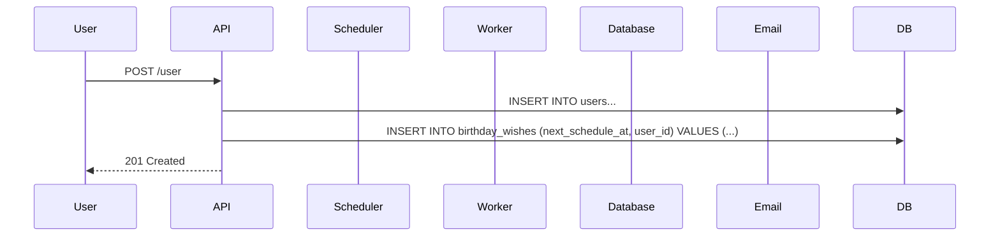
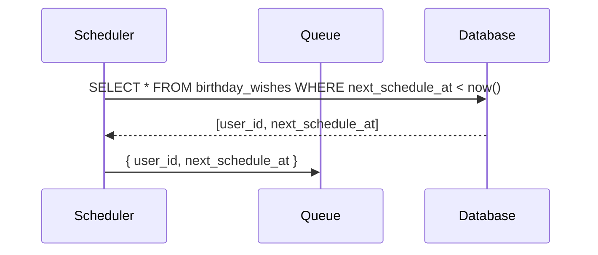
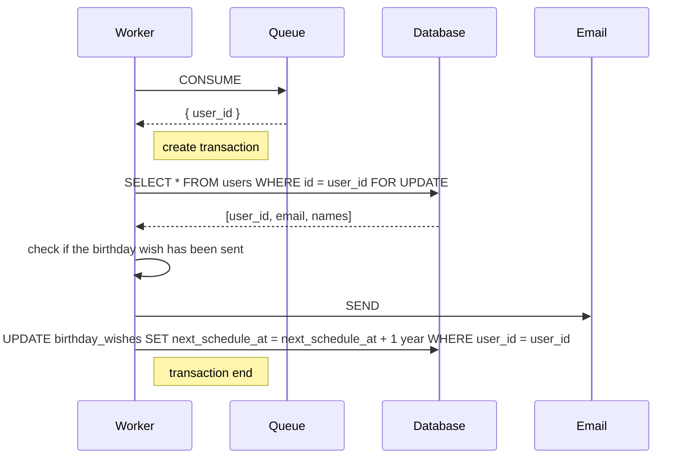

# Birthday Wishes

This repo will send birthday wishes at 9am on their local time.

## System Design

### Sequence Diagrams

#### User Registration / Edit
On registration, the user's birthday is stored in the database and a birthday wish is scheduled to be sent at 9am on their birthday.

Similar thing happened when the user edit their birthday, we just adjust the next schedule time.

#### Scheduler

Will run every 5 minutes to check if there are any birthday wishes to be sent. This way, it will be resilient. Even if the scheduler is down, the birthday wishes will be sent when the scheduler is up and running.

The scheduler main jon is only to query the recipients candidates then publish to Queue. It does not send the email. We cant do horizontal scaling if we send emails in the scheduler.

#### Worker

This is a long running background process that will listen to the Queue topic and send the birthday wishes. **We can scale this vertically/horizontally** to handle more birthday wishes. We cant do horizontal scaling with scheduler only.

We lock the user row in the database for **idempotency**. This way, if 2 workers are running, they will not send the same birthday wish twice.

## Tech stacks

- Nest.js: just because it already has scheduler support.
- MySQL: any database that support row lock will do.
- Kafka/Redis : for the queue
- Docker: for the deployment.

## Deployment Plan

This is a simple application and can be deployed in a single server. We can use docker compose to deploy everything.